# Week 1

## Intro to Operations Research

### Types of Analytics Overview
Analytics Type|Description
-|-
`Descriptive`     | insight into past events, using historical data
`Predictive`      | provides insight on what will happen in the
`Prescriptive`    | helps with decision making by providing actionable advice

### Classifications of optimization models
Option 1|vs|Option 2
-|-|-
`Static` (*fixed*)    |*vs.*| `dynamic` (*can be updated*)
`Linear`              |*vs.*| `nonlinear`
`Integer`             |*vs*.| `noninteger`
`Deterministic` (is a vacuum) |*vs*.| `stochastic` (many unkowns)

* *We will be using `static`, `linear`, `non-integer`, `deterministic` models*

### `Prescriptive Analytics` (*LP Optimization*) ***in General***

#### In order to optimize anything (*via `linear programming`*), you must have:
Step| Name                    | Description               |Example
----|-------------------------|---------------------------|----
1   | `Input Data`            | Form of sets or parameters| Weights in stock
2   | `Descision variables`   | *Solution*                | Weights in stock
3   | `Constraints`           | *Limiting factor*         | Portfolio = 100%, total dollars invested <= amt. you own, etc.
4   | `Objective Function`    | *Maximize` or `minimize* a function  | Expected Return

### `Linear Programming` ***Example***
Step| Name                    | Example               
----|-------------------------|----
1   | `Input Data`            | 
2   | `Descision variables`   | 
3   | `Constraints`           | 
4   | `Objective Function`    | 

---

## Linear Algebra

### Determine if two matrices can be multiplied together (defined)
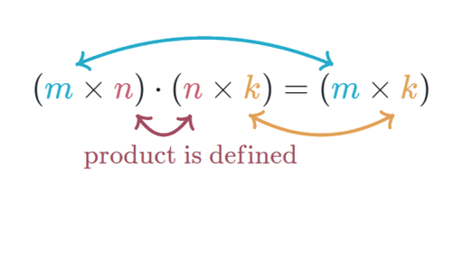

Topic|Example
-|-
Dot product ***in general*** | 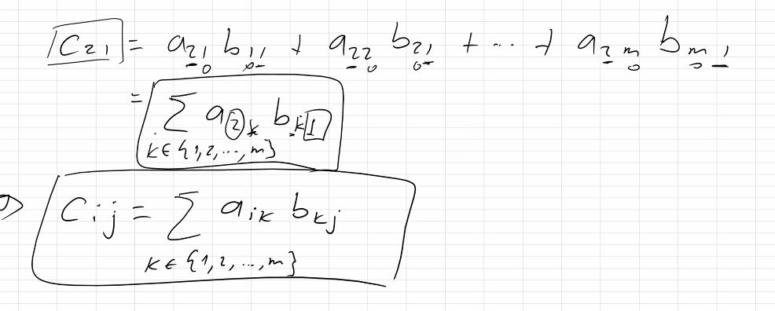  
Go *from* System of Linear Equations *to* Matrix Notation | 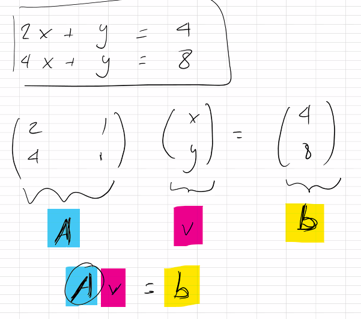   
Solve for `v` from inverse | 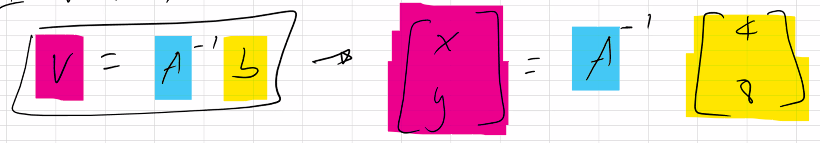   
 Find determent of `2x2 matrix`| 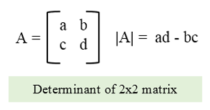   
 `Cofactor` of 2x2 matrix | 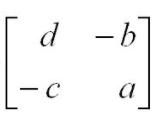   
 Inverse of 2x2 matrix | 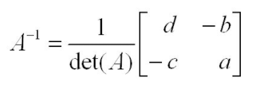   

 

### `Solve System of Linear Equations`
Step|Description|Example
-|-|-
1 - 4   |How to ***solve*** a `system of linear equations` with `Gaussian Elimination`| 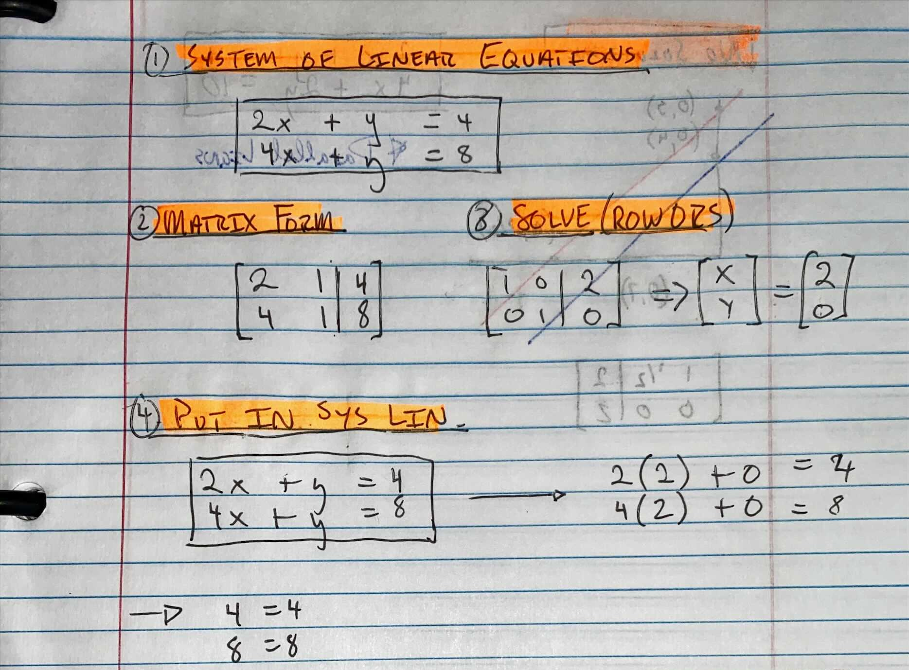

### Types of `Solutions to Linear Equations`
Solution Type|Description|Example
-|-|-
`One Solution`    | ***Intersection of two lines*** | 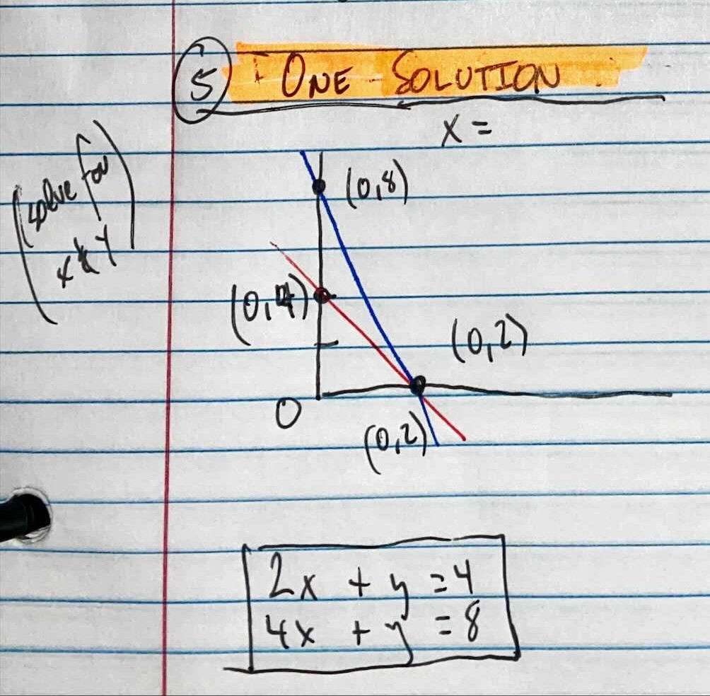
`No Solution`     | ***Parallel Lines*** |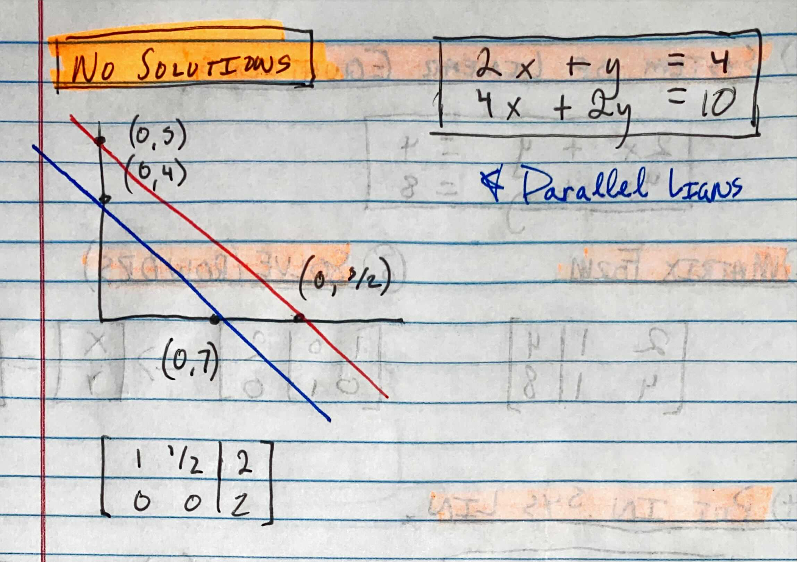
`Infinite Solutions` | ***Same Line***, `Linear Dependence`|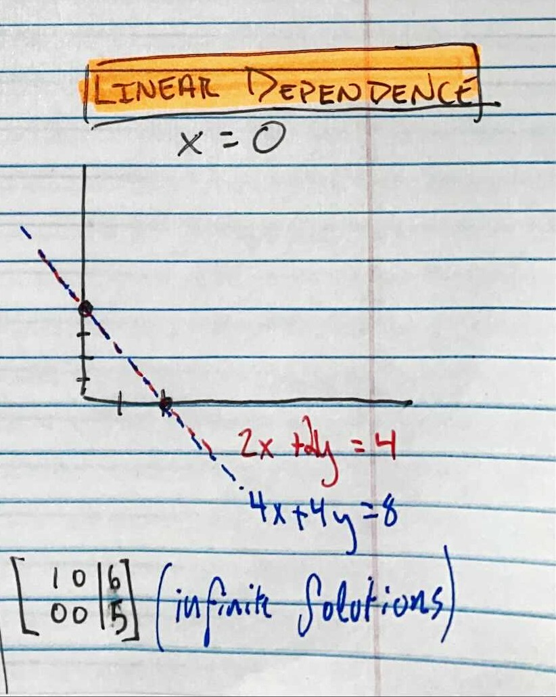

### Resources
* [Main Calculator](https://matrixcalc.org/en/)
* [Linear Algebra Full Notes](https://sooners-my.sharepoint.com/personal/danielcarpenter_ou_edu/_layouts/15/onedrive.aspx?id=%2Fpersonal%2Fdanielcarpenter%5Fou%5Fedu%2FDocuments%2F1%2E%20School%2F1%2E%20University%20of%20Oklahoma%2F1%20%2D%20Undergraduate%20%28Economics%20and%20Finance%29%2F4%2E%20Senior%2FSPRING%202020%2FLinear%20Alg%2E%20%28MATH%2D3333%2D001%29%2FLecture%20Notes%2FCourse%20Notes%20Binder%2Epdf&parent=%2Fpersonal%2Fdanielcarpenter%5Fou%5Fedu%2FDocuments%2F1%2E%20School%2F1%2E%20University%20of%20Oklahoma%2F1%20%2D%20Undergraduate%20%28Economics%20and%20Finance%29%2F4%2E%20Senior%2FSPRING%202020%2FLinear%20Alg%2E%20%28MATH%2D3333%2D001%29%2FLecture%20Notes)