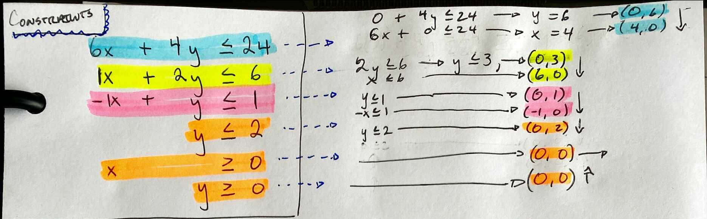
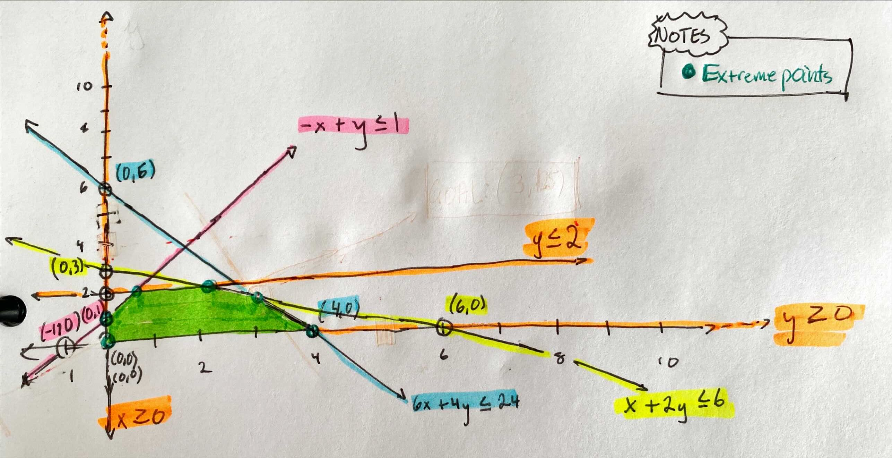
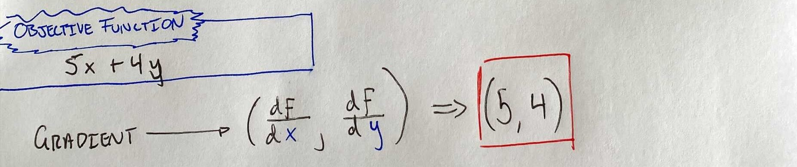
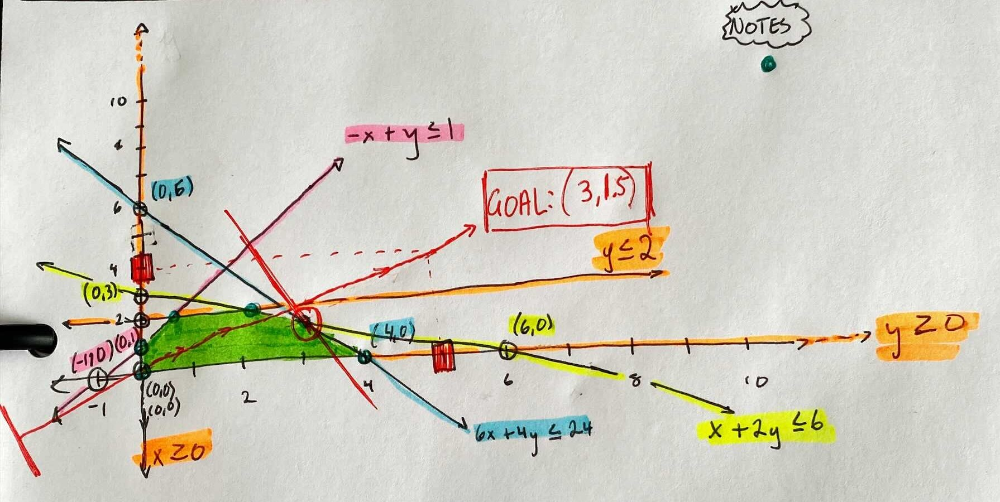

# Week 3 - Linear Programming

## Different Ways to Solve Linear Model
1. [Graphically (*see calculator*)](https://www.pmcalculators.com/graphical-method-calculator/)

2. Solver in `Excel` *(see workbook in dir)*
3. Using code with tools like `Gurobi` *(see `.py` file in dir)*

---

## 1 - Linear Programming with `Graphs`

* [Graphing calculator with two variable model](https://www.pmcalculators.com/graphical-method-calculator/)

Step| Description | Example
----|-------------|---------
1   | Calculate `points of constraint lines` *(`Shade`: plug `0` in equation)*  ) | 
2   | `Draw constraint lines` from points. |   
3   | Use `objective function` to *maximize the area* See below for ***`MINIMUM`***| 
4   | `Plot objective function steps` (*gradient function*); determine `decision variables` | 

### `Minimizing` and `Maximizing` Objective Function
Goal         | Instructions
-------------|--------------------------------------
`Maximizing` | go in the direciton of the gradient
`Maximizing` | go against the gradient direction

### Solve Graphically
1. Determine the `active` constraint(s) (constraints that *touch* the solution)
2. Solve system of equations for the active constraints (using `guassian`)
3. Optimal point `must be an extreme point`