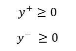

# Week 5 - `Simplex` Tableau

## Resources
* [Simplex: ***Two Phase*** method (*see calculator*)](https://www.pmcalculators.com/simplex-method-calculator/)
* [Simplex: ***Big M*** method (*see calculator*)](https://www.pmcalculators.com/big-m-method-calculator/)

## Overview of `Simplex` Setup:
> Convert constraint problem into system of linear equations by creating `artificial variables`

 ### Steps to `Simplex` Setup (Convert ***expressions*** *into* ***equations***)
1. Set `LHS` *equal to* `RHS` using ***slack variable*** (`S`)
2. If *negative* on `RHS`, then flip signs of `RHS` and `LHS`
3. Make sure all ***slack variables*** are `non-negative`

---

### `1` - Example of Setting `LHS` *equal to* `RHS` using ***slack variable*** (`S`)
Given **Expression**:
```
6x + 4y <= 24
```

Change to **Equation** with ***Slack Variable*** `S1`
```
6x + 4y + S1 = 24
```
Notate Change in assumptions *(add to old notes)*
```
S1 >= 0
```

#### **Important Note** regarding `slack variable`:
* If `<=` then `+`S1  
* If `>=` then `-`S1  

---

### `2` - Example of *negative* on `RHS`, then flip signs of `RHS` and `LHS`
Given Converted **Equation**:
```
 10x + 10y + S1 = -50
```

***Flip signs*** of all variables, so that `RHS is positive`
```
-10x - 10y - S1 = 50
```

---

### `3` - `Negative` and `Unrestricted` Variables 

#### `3.1` - `Free` Variables
Given **Expression** and `y` ***is free***:
```
 x + y <= 10 
```

Replace `y` with (`y - y`):
<br> 

Notate Change in assumptions *(remove old notes)*
<br> 

***

#### `3.2` - `Negative` Variables
Given **Expression** with `-x`:
```
-x + y <= 10
```

Replace `x` with (`-x hat`):
<br> 

Notate Change in assumptions *(remove old notes)*
<br> 

***

### **Example** of `Free` and `Negative` Variables

#### ***Original***


#### ***Converted***


---

## Notation

### Go from Linear Equations to `Standard Form`
Form                | Example
--------------------|-----------
`Linear` Equation   | 
`Matrix` Form       | 
`Canonical` Form    | 
`Standard` Form     | 

---

### Determine `# of Solutions` Given System of Equations
* Must all be *`linearly independant`*
* Assume `m` equations and `n` variables

Condition   | Number of Solutions
------------|---------------------
`m < n`     | Infinite Solutions
`m = n`     | One Unique Solution
`m > n`     | No Solution

---

## `Simplex Algorithm`

### How to find `ALL` Feasible Solutions
> Simplex overcomes searching for all possible solutions, by aiming in direction of objective and only checking feasible solutions

* Note that there is the potential of many solutions, if you check all of them (*# of unique combinations*): <br>


Step | Description | Example
-----|-------------|-----------
0    | Problem | 
0    | *Converted* Problem | 
1    | Find `basic solutions` (the ***extreme points***, or the ***intersection*** of constraints) | 
2    | Check if basic solutions are `feasible` | 
3    | Determine `max` or `min` of feasible solutions | 

### Use `Simplex` to find Solution (*Algrbraically*)
Step| Description   | Example
----|---------------|-----------
1   | Start from a feasible basic solution | 
2   | Check if there is any “promising” direction to move. `min` = choose ***positive*** value, `max` = choose ***negative*** value  | 
3.0 | From all the “promising” directions, move in the “most promising” direction, and update basic and non basic variables | See below
3.1 | Convert to `matrix` form | 
3.2 | Solve using `Guass-Jordan` | 
3.3 | `Parse Solution` from Guass-Jordan Solution | 

---

## `Big M` to Find Initial Basic Solution
```
Big M - when there is a >= constraint
-1 * offending row
-1 * offending row again, but RHS stays positive. Make r variable with positive 1, and z row large number
Make r identity
Iterate with simplex until optimal
```

## `Two-Phase` to Find Initial Basic Solution
```
Two phase
Make slack var negative and r positive
Minus one in z row for r var
Make r identity
Iterate with simplex until optimal
```

---

## `Sensitivity Analysis`
