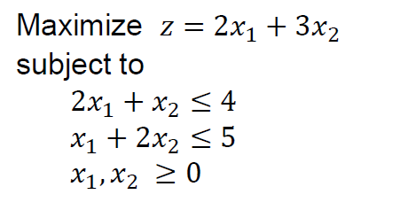
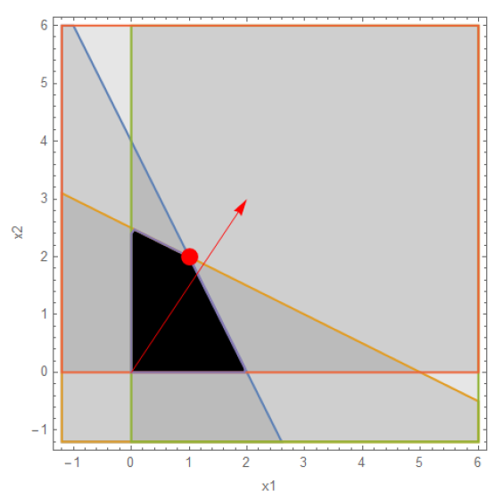
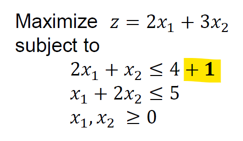
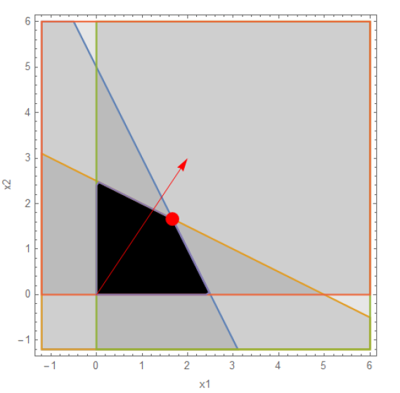
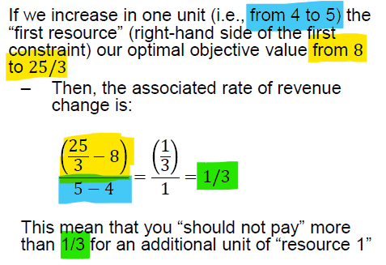
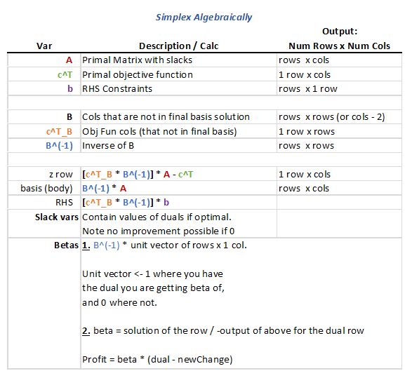
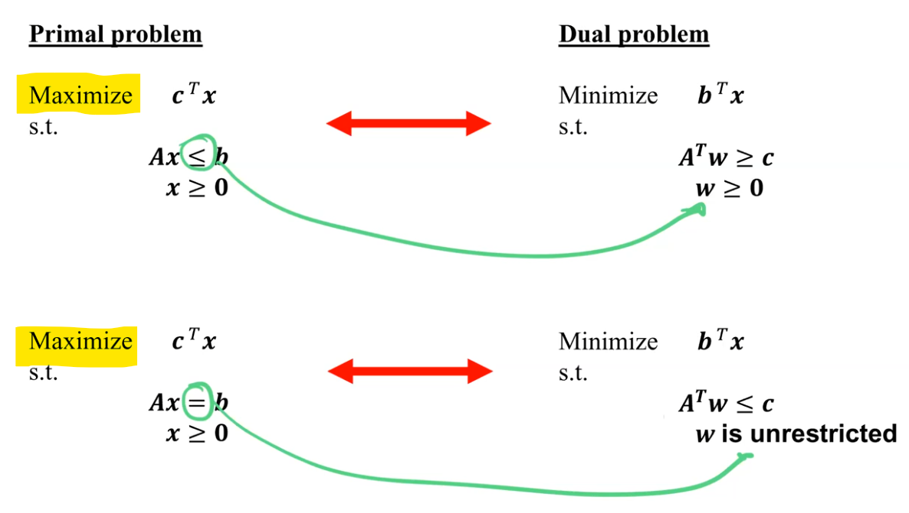
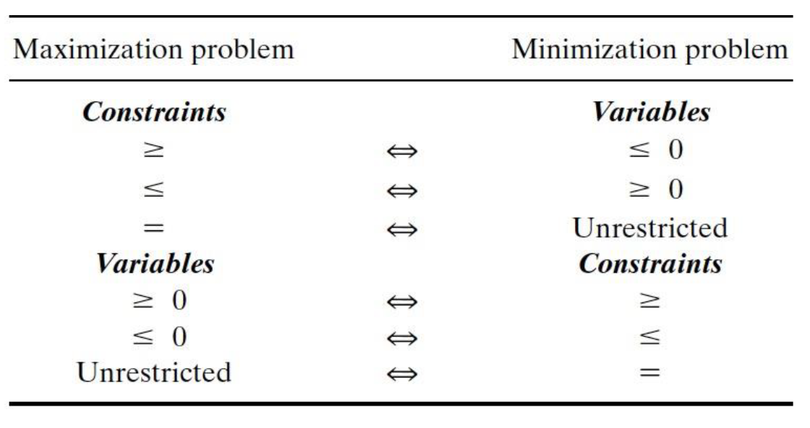

# Week 8 - 9 - Simplex Algebraically and Calculating `Duals`/`Betas`

## Goals
* Use algebra instead of simplex iterations to get optimal solution
* `Slack` variables in `z` row give values of duals, or the `shadow prices` 

## Resources:
* [Primal to Dual Conversion Calculator](https://cbom.atozmath.com/CBOM/Simplex.aspx?q=pd)

---
 

## 1 - `Sensitivity Analysis `

### Main Topics of Sensitivity Analysis
1. Vector of Costs
2. Coefficient Matrices
3. Changing Right Hand Side

 

### Example of Sensitivity Analysis

Change  | Graphical
--------|-----------
 | 
 | 
`Interpretation / Calculation` | 

---
 

## `Duals` Overview
> Use duals to conduct a sensitivity analysis of constraint model

### Rules to `Duals`
* Dual Variables are the `shadow prices`, or the maximimum amount willing to change what you pay for a variable without changing the basis.
* Calculating the Duals will give you incremental changes in model while getting same optimal.

### Considerations of the Dual Variables
* If the dual variables are 0 at optimal, then you should not vary the amount paid for this variable. You will not benefit.

### `Betas` show the bounds
* Calculate the betas to show the bounds of model while still having same optimal

---
 

## General Calculation Rules (See excel solutions for examples)

---
 

## Creating a `Dual Model` and then Optimizing

### `Strong` Duality
* Dual and primal's *(original model)* objective function values are the same
* Basis of the primal are the variables for the dual
* If the primal has an optimal solution, then the dual has optimal

### `Weak` Duality
* Solution to the dual problem does not equal the solution to the associated primal problem
* Note that If the primal is unbounded, then the dual is infeasible

---
 

### Setting up the `Dual` from the `Primal`
* [Primal to Dual Conversion Calculator](https://cbom.atozmath.com/CBOM/Simplex.aspx?q=pd)

### Rules of Setting up Duality
* If not in canonical form, then switch signs of inequality of dual problem

    

---
 

## `Reviewing Post-Optimal Considerations`
Impact on Analyis | Change to the model | Example
------------------|---------------------|------
`Feasibility`     | (1) RHS, or (2) New Constraint | Scale an entire  constraint line 
`Optimality `     | (1) Objective Function Coefficients, or (1) new activity | Could change the angle of the gradient