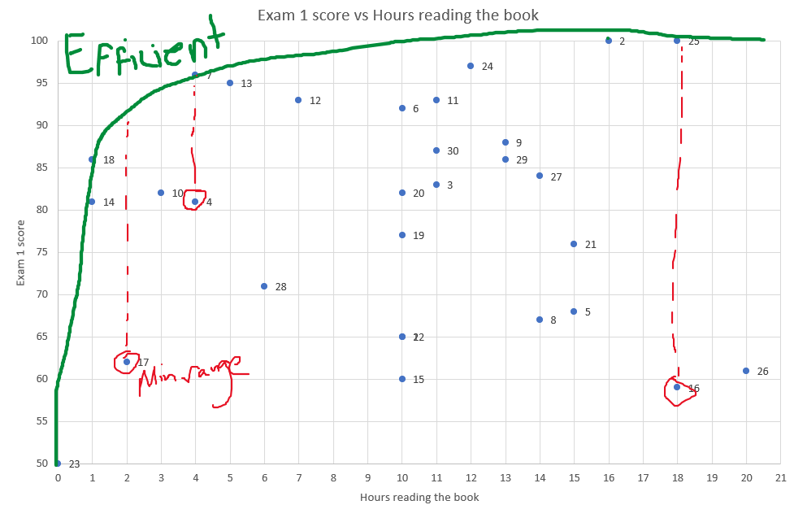
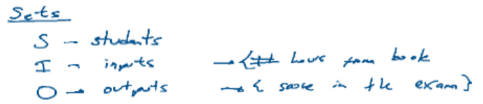
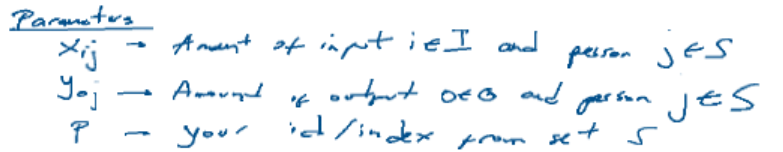
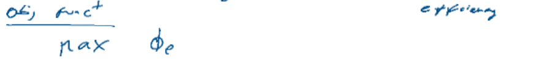
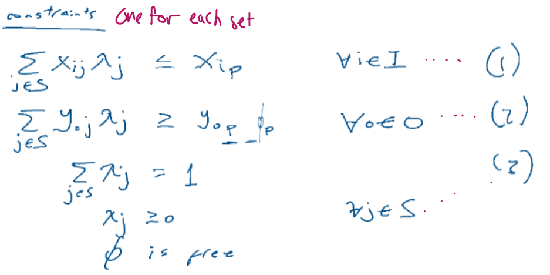

# Week 10 - Data Envelope Analysis

## Overview of `DEA`
* Understand if you are efficient compared to your peers
* I.e. Measures the relative efficiency of organizational units

## Determining whether `inefficient` or `efficient`

### `Terminology` for Efficiencies
Term        | Description
------------|-------------
`Efficient` | `Max` value obtained among each value of the independant variable
Inefficient | `Minimum` value obtained among each value of the independant variable

  

---
 

## `Setup` for Data Envelope Analysis

### `1` - Determine the following:

n | Step        | Description | Example
--|-------------|-------------|---------
1 | `Sets`      | Objects used | 
2 | `Parameters`| Amount of input/ouput and indices | 
3 | `Variables` | ***lambdas***, ***phi*** * | 
4 | `Objective Function` | Maximize `phi` | 
5 | `Constraints` | One for each constraint. Phi is unconstrained. | 

#### Notes on Variables `phi` and `lambda`
Variable Name | Description
--------------|-------------
***lambdas*** | percentage / fraction given to a person (set) 
***phi***     | Proportional change of the output needed to achieve efficiency

#### What if you need to add another `set` and `parameter` (whether input or output)?
* Add another input or output parameter
* Add associated constraint, using the original `<=` `(input)` or `>=` `(output)` constraint as template
* 

### `2` - Establish Actual Model
* Use Gurobi-Python or Excel to maximize phi s.t. constraints